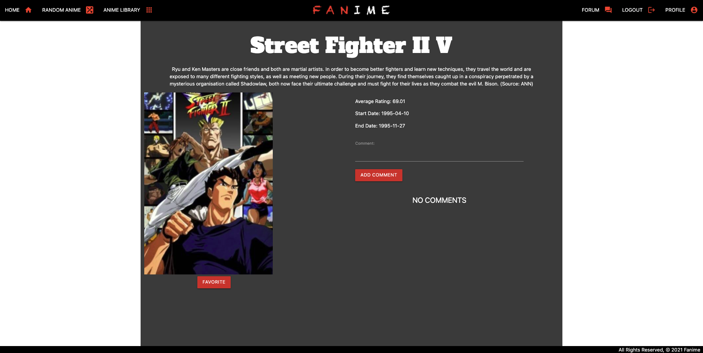
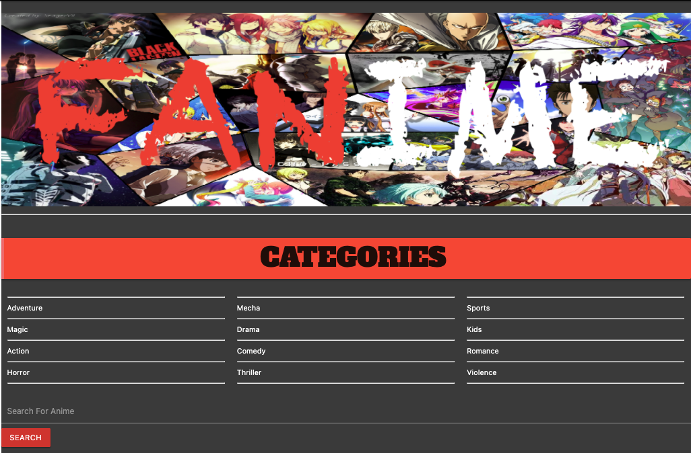
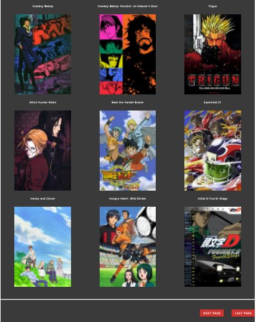

# FANIME

FANIME is a user based web app that lets you track and organize data about the Anime shows or movies you are interested in. Users can create a profile, upload a profile picture including information such as your name, Favorite Anime, an about you input to give a short introduction to who you are. Once you are Signed up, and logged in you can explore Fanimes huge library of Anime, or to narrow it down we have genres, and a search bar. 

### Signup

To get the most out of the Fanime app, users will need to sign up and create a Profile by clicking on the SIGNUP button found at the top-left of the browser. Signing up only requires a unique Username not taken by another user, and a password. Django’s sign up form describes the necessary parameters to ensure a more secure user experience. Once logged in, users can add any anime to their Favorites List which they can access from their Profile page. Users can also participate in an anime’s comments section once they are logged in.

### Profile

### Random Anime

Out of good anime to watch? Fanime utilizes Kitsu, a third party API which houses a vast library of over 11,000 anime. Visitors gain access to this entire library by browsing Fanime’s Library found in the navigation menu. Don’t know where to start? Users can filter their genre of choice at the top of the Anime Library page. Also, by clicking the RANDOM ANIME button in the navigation menu, Fanime will randomly generate a title from Kitsu’s library where you can read the show’s synopsis. Every click returns a new anime that you can favorite or skip on to the next one.

### Library

Fanime uses the Kitsu API to generate all of our anime for our users. When a user clicks on a specific anime it is then saved to our database. The more users explore Fanime the larger our anime database grows.

### Technologies Used

- Python3, HTML, CSS
- Materialize
- Django
- POSTGRESQL
- Heroku
- Kitsu API

### Getting Started

- [Log in and become a Fan of Anime!](https://fanimeh.herokuapp.com/)
- [Trello Board](https://trello.com/b/uYKG3UhL/fanime-app)

### Future Features

- Give users the ability to know when the next episode of their favorite anime comes out.
- A page that displays other users favorite anime for social interaction.
- I want to be able to have discourse with other users on a certain post about an anime.
- The ability to add a photo or video file to your comments.
- Display the total number of Anime in a users page. 
- Ability to edit profile picture.
- Show profile picture next to comment.
- Forum coming soon.

